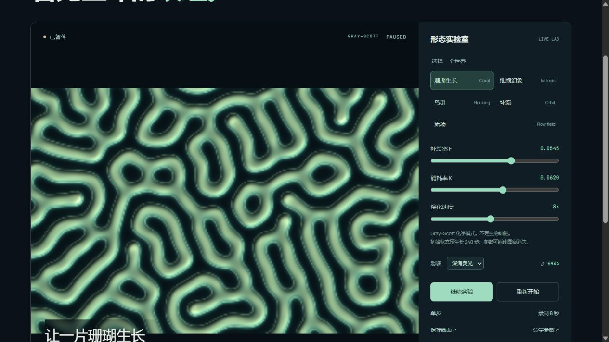

# Emergence Lab · 涌现实验室

**改变局部规则，看形态自己长出来。**

[在线体验](https://wangchuan2003-a11y.github.io/emergence-lab/#preset=coral) · [黏菌网络](https://wangchuan2003-a11y.github.io/emergence-lab/#preset=physarum) · [科学来源](docs/references.md) · [迭代记录](docs/iterations.md)



一个在浏览器本地运行的人工生命与群体运动实验室。TypeScript + Canvas 2D；无需账户、后端或 API Key。

## 六个世界，三类规则

| 模式                | 机制                         | 可探索的变化                       |
| ------------------- | ---------------------------- | ---------------------------------- |
| 珊瑚生长 / 细胞幻象 | Gray–Scott 反应扩散          | 补给、消耗与扩散如何形成斑点和迷宫 |
| 黏菌网络            | 粒子感知并留下浓度轨迹       | 局部反馈如何形成通道与分支         |
| 鸟群 / 环流 / 流场  | Boids 风格邻域交互与外部力场 | 聚合、分离和方向对齐如何改变群体   |

珊瑚和细胞形态不是生物组织预测；黏菌模式是受趋化行为启发的工程模型，不代表真实黏菌，也不保证寻找最短路线。

## 30 秒开始

1. 选一个世界，改变参数，或用中心扰动加入一个刺激。
2. 在生长与网络模式按住画布播种，选择「擦除」清空局部浓度。笔刷支持大小调节与触屏连续绘制。
3. 空格暂停，右方向键单步（画布获得焦点时）；开启系统减少动态效果时默认暂停。
4. 切换深海荧光、琥珀熔岩或冷光银盐，导出 PNG 或最多 8 秒的视频。

录像优先 WebM，支持时可回退 MP4。录制期间锁定场景重置和尺寸变化；不支持录制的浏览器仍可保存 PNG。

## 分享参数，或保存这一刻

**参数链接**保存种子和设置，从初始条件重新开始。复制失败时直接复制地址栏。

**实验快照**保存当前浓度场、粒子位置/速度/方向及数值步数，包含画笔造成的状态变化。打开「保存与恢复实验」导出 JSON，稍后导入会在原数值步暂停。最大 3 MB；损坏、未知版本或越界文件会被拒绝，当前实验不变。

快照不保存鼠标位置、渲染拖尾像素或操作历史。相同浏览器实现中的状态续跑有逐数组回归测试；不同平台的浮点三角函数可能产生微小差异。

## 运行与验证

需要 Node.js 22.12+。

```sh
npm ci
npm run dev
npm test
npm run build
npx playwright install chromium
npx playwright test
```

GitHub Actions 对每次 main 推送和 PR 执行数值/状态测试、TypeScript 构建及桌面/手机浏览器回归，通过后部署 main 到 GitHub Pages。Fork 后在 Settings → Pages 选择 GitHub Actions。

## 实现要点

- 粒子引擎使用空间网格搜索，同步计算新速度，周期边界；极端聚集仍可能退化为平方复杂度。
- 反应扩散使用两套 Float32 缓冲和九点 Laplacian；256×160 网格，初始预演 240 步，计数公开显示。
- 黏菌网络同步读取旧浓度场、三探头采样、移动与沉积，再扩散和衰减。平局由种子、步数和粒子索引决定，无隐藏随机状态。初始预演 120 步。
- 渲染与模型分离；影调是数据的视觉映射，不改变演化。慢设备限制追赶工作，模拟时间可以慢于真实时间。
- 录制控制器有明确的 recording/stopping/idle 状态，等待最后一批编码数据，拒绝空视频并清理轨道。

```text
src/engine.ts       粒子邻域与运动
src/reaction.ts     Gray–Scott 数值场
src/physarum.ts     趋化轨迹网络
src/snapshot.ts     快照格式与完整验证
src/capture.ts      浏览器视频生命周期
src/main.ts         状态协调、绘制与交互
src/style.css      响应式界面
tests/             算法、状态、恢复与浏览器回归
```

## 来源与边界

- [Karl Sims：Reaction-Diffusion Tutorial](https://www.karlsims.com/rd.html)
- [Craig Reynolds：Boids](https://www.red3d.com/cwr/boids/)
- [Jeff Jones (2010)：Physarum transport networks](https://pubmed.ncbi.nlm.nih.gov/20067403/)；本项目是受摘要所述机制启发的简化实现，未宣称精确复现其完整方法。

[完整参考记录](docs/references.md) · [后续调研与证据边界](docs/research-next.md)

所有模拟与文件解析在浏览器本地进行；应用不上传快照、不调用外部 AI、不配置追踪。托管方可能保留其常规访问日志。Canvas 画面不是完整的屏幕阅读器数据表示；控件、快捷键与状态消息支持键盘访问。性能依赖设备、密度及参数。

## English

A local-first artificial-life playground with flocking, Gray–Scott reaction diffusion and Physarum-inspired trail networks. Paint, tune, pause, single-step, export images/video, share seeded configurations, or save exact numerical checkpoints. Chinese-first UI, open TypeScript source, no backend or API key.

## License

MIT. Manrope and JetBrains Mono are self-hosted under their included SIL Open Font License files. Built with AI assistance; original scientific concepts remain attributed to their authors. No endorsement or validated biological prediction is implied.

### 高清导出

PNG 可选择屏幕原样、1920 px 或 3840 px。高清模式按模型的原始比例重新绘制，去掉留边；它增加输出像素，不提高模拟网格精度。粒子高清重绘不包含过去帧的屏幕拖尾，因此需要保留屏幕原样时选择第一项。PNG 文件名在点击时固定，不受编码期间切换场景影响。

快照导入会尊重较新的操作：读取途中切换场景或重新选择文件，旧读取结果不会覆盖新实验。网络快照同时保留粒子叠加开关；旧快照缺少该字段时默认显示。

### English interface

Use **EN** in the header or open [the English lab](https://wangchuan2003-a11y.github.io/emergence-lab/#preset=coral&lang=en). Switching languages preserves the running model and numerical step. Shared settings include language; scientific states and checkpoint files are independent of UI language.
