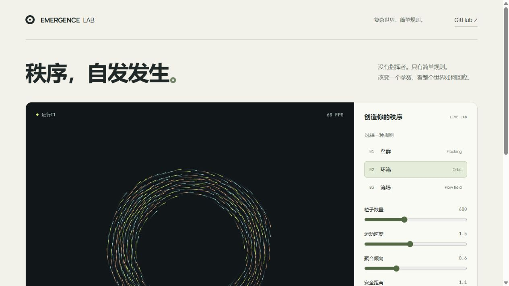

# Emergence Lab

**改变简单规则，亲手创造复杂秩序。**

[在线体验](https://wangchuan2003-a11y.github.io/emergence-lab/) · [English](#english) · [算法参考](https://www.red3d.com/cwr/boids/)



一个可交互、可复现的粒子群体实验室。没有后端、账号或 API Key。所有模拟在浏览器本地运行。

## 30 秒试玩

1. 打开在线演示，切换 **鸟群 / 环流 / 流场**。
2. 移动鼠标吸引粒子，按住排斥；键盘和手机可用「中心扰动」。
3. 调整聚合倾向和安全距离，观察整体结构变化。
4. 用「分享参数」保存实验起点，用「保存画面」导出 PNG。

## 为什么会形成秩序？

鸟群模式采用 Boids 风格的三个局部规则：聚合、分离与速度对齐。环流加入径向恢复力和切向驱动；流场加入随空间和时间变化的方向场。这是用于探索和视觉表达的模型，不是对真实鸟群或物理系统的精确预测。

- **空间哈希邻域搜索**：只检查附近网格，避免普通场景中对全部粒子两两比较。极端聚集时仍可能退化为平方复杂度。
- **同步状态更新**：先计算全部新速度，再更新位置，避免按数组顺序原地更新带来的偏差。
- **固定时间步长**：以 60 Hz 模拟步长运行，慢设备限步以保持交互响应，因此会放慢模拟时间。
- **可复现种子**：相同设置、相同模拟步数且没有交互时可复现轨迹。分享链接保存初始参数，不保存当前帧或鼠标操作。不同浏览器的浮点实现可能存在细微差别。
- **环绕边界**：粒子穿过边缘后从另一侧出现，邻域距离同样考虑环绕。

## 本地运行

需要 Node.js 22.12+。

```sh
npm ci
npm run dev
```

```sh
npm test              # 算法与参数测试
npm run build         # TypeScript 检查与生产构建
npx playwright install chromium
npx playwright test   # 桌面、手机关键交互测试
```

GitHub Actions 在推送和 PR 时执行测试与构建；main 通过后部署到 GitHub Pages。首次 fork 部署需在仓库 Settings → Pages 中选择 GitHub Actions。

## 项目结构

```text
src/engine.ts           可独立测试的模拟引擎
src/main.ts             Canvas 渲染与交互
src/style.css           响应式界面
public/                本地字体及其许可证
 tests/engine.test.mjs   算法、边界与复现测试
 tests/browser/         Playwright 交互回归
.github/workflows/      测试与 Pages 部署
```

## 交互与限制

- 100–1400 个粒子；性能取决于设备、粒子密度与浏览器，界面显示实时 FPS。
- 尊重 `prefers-reduced-motion`，首次打开默认暂停；可手动开始。
- 控件支持键盘操作；Canvas 图案本身不是完整的无障碍数据表示。
- 手机支持控件和中心扰动；鼠标悬停吸引仅适用于有指针的设备。
- 分享复制失败时，直接复制浏览器地址栏；全屏支持取决于浏览器。
- 页面本身不进行追踪或上传数据；GitHub Pages 等托管服务可能保留其常规访问日志。

## English

An interactive, deterministic particle laboratory built with **TypeScript + Canvas 2D + Vite**. Explore flocking, orbital flow and animated vector fields, tune local rules, export PNGs and share seeded starting conditions. No backend or API key required. Chinese-first interface; source and engineering notes are available in this repository.

## Credits & license

Boids concept: Craig Reynolds, 1987. The code here is an independent educational implementation. Manrope and JetBrains Mono are self-hosted with their SIL Open Font License files included in `public/`.

Project code: MIT. Built with AI assistance; claims about behavior are covered by the included tests rather than implied production adoption.

## 生长模式升级


[直接进入珊瑚生长](https://wangchuan2003-a11y.github.io/emergence-lab/#preset=coral) · [细胞幻象](https://wangchuan2003-a11y.github.io/emergence-lab/#preset=cells)

新增 **珊瑚生长 / 细胞幻象** 两个 Gray–Scott 反应扩散预设：按住画布播种，Shift 按住擦除；键盘或手机可使用中心扰动。调整补给率、消耗率和演化速度，切换深海荧光、琥珀熔岩或冷光银盐影调。单步按钮暂停并推进一次（反应模式推进所选倍数的数值步）。

「录制 8 秒」使用浏览器 MediaRecorder 导出仅含画布的视频，可提前停止。浏览器支持 WebM 时优先 WebM，否则尝试 MP4；不支持时保留 PNG 导出。录制不会强制恢复暂停的实验，首次下载权限由浏览器管理。

这两个模式是**虚拟化学场产生的形态**，不是真实生物细胞或珊瑚组织的预测模型。初始化包含 240 步预生长，页面显示实际数值步数。调整参数可能导致图案消退。原来的粒子模式与分享链接仍然兼容。

方程、参考参数与视觉灵感来自 [Karl Sims 原始教程](https://www.karlsims.com/rd.html)。完整的来源与不确定性见 [references.md](docs/references.md)。新增实现位于 `src/reaction.ts`；新增数值测试包括独立模板算子的逐点核对、均匀场平衡、播种、擦除、可复现性和默认展示场的活跃性。

## 保存这一刻

打开「保存与恢复实验」，可导出当前实验的 JSON 快照，再用「打开快照」恢复到相同数值步。它保留反应物浓度、播种结果或粒子状态，也保存尚未结束的中心扰动；不保存鼠标位置或屏幕拖尾。导入后默认暂停，继续即可演化。文件只在浏览器内读取，最大 3 MB；不支持的版本、损坏内容或越界数据会被拒绝，当前实验保持原样。

生长模式现在有可点击的播种/擦除工具和笔刷大小，支持触屏连续绘制。画布获得键盘焦点后，空格暂停/继续，右方向键单步。录制期间锁定模式、重置与快照导入，画布尺寸更新等到视频结束，防止文件名、内容或尺寸在录制中改变。
