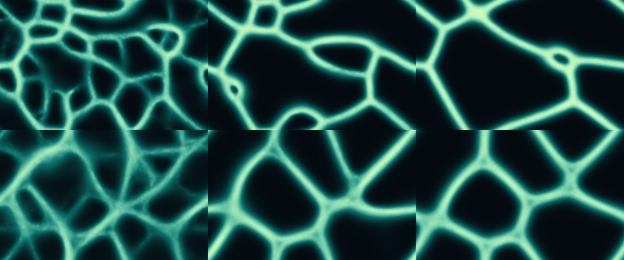

# Scientific and visual references — 2026-09-06

## Implemented reference

Karl Sims, [Reaction-Diffusion Tutorial](https://www.karlsims.com/rd.html), original page retrieved 2026-09-06. It describes Gray–Scott reactions, two chemical fields, DA=1, DB=.5, dt=1, and a nine-point Laplacian with center -1, orthogonal .2, diagonal .05. Its named video examples give:

- Mitosis: F=.0367, K=.0649.
- Coral growth: F=.0545, K=.062.

The tutorial also describes lighting the concentration field to give a 3D appearance. This release independently implements those equations and the visual idea; it does not copy the author's video, image assets, or implementation. The new shading palette, controls and recorder are this project's own presentation.

The earlier flocking mode is inspired by [Craig Reynolds' Boids](https://www.red3d.com/cwr/boids/).

## Candidate lead, not an attribution

Search surfaced [Richard Dawkins' Watchmaker Suite](https://watchmakersuite.sourceforge.net/) and [Biomorph Builder](https://biomorphbuilder.com/). They are useful leads for branching morphology and artificial selection. They are not implemented in this release. No evidence collected here establishes that either is the particular recent AI animation meant by the user, or that Dawkins authored a recent AI-built web animation. Do not attach his name to this implementation as endorsement or authorship.

## Boundaries

This is AI-assisted software development of an educational mathematical animation. It is not a generative video model, a biological experiment, actual cell division, or a validated model of coral tissue. Display shading does not add physical three-dimensional geometry. Parameters can extinguish patterns or saturate a field; that is a possible model outcome, not proof of an implementation failure.

## Numerical implementation

256 × 160 grid; simultaneous double-buffered updates; periodic boundary; explicit Euler dt=1; concentrations constrained to [0,1]. Default configurations are seeded with 24 local inoculations and pre-evolved 240 steps so growth is visible immediately. The pre-evolution and ongoing update count are displayed. A share link preserves parameters and seed, not brushes or present state. Frame scheduling caps catch-up work on slow devices; model time can therefore run slower than wall time.

## Physarum-inspired network extension — 2026-09-07

Implemented from the mechanism described in the Jones (2010) author abstract and the engineering proposal in research-next.md. The full original method was not available during this work, so this is explicitly an independent simplified model.

Each particle samples three points in the previous concentration field. If both side sensors dominate the front, a stateless hash chooses a side; otherwise the strongest sensor guides turning. Particles move one grid unit, leave one arbitrary unit, and a periodic 3×3 box average diffuses the combined field before retention is applied. Particle overlap is allowed.

Engineering difference: sensor response saturates at `max(0.5, count/(width*height) * retention/(1-retention) * 2)`; the stored concentration field itself is not truncated. This limits runaway preference for a single high-intensity route in this implementation. It is an implementation choice, not a parameter claimed from the paper or a measured biological property.

At seed 42, actual code renders at 100, 300 and 600 steps are shown below. Upper row: defaults (count=4000, distance=9, angles=45/45, retention=.95). Lower row: distance=18, sensor angle=22, turn=32, retention=.97. These pictures describe these specific runs, not universal or biological behavior.

The visible specks in the app, when enabled, are actual agent positions. They can be hidden independently of the concentration field. No claim of shortest-path optimality, intelligence, nutrient metabolism, growth or real tissue behavior is made.
